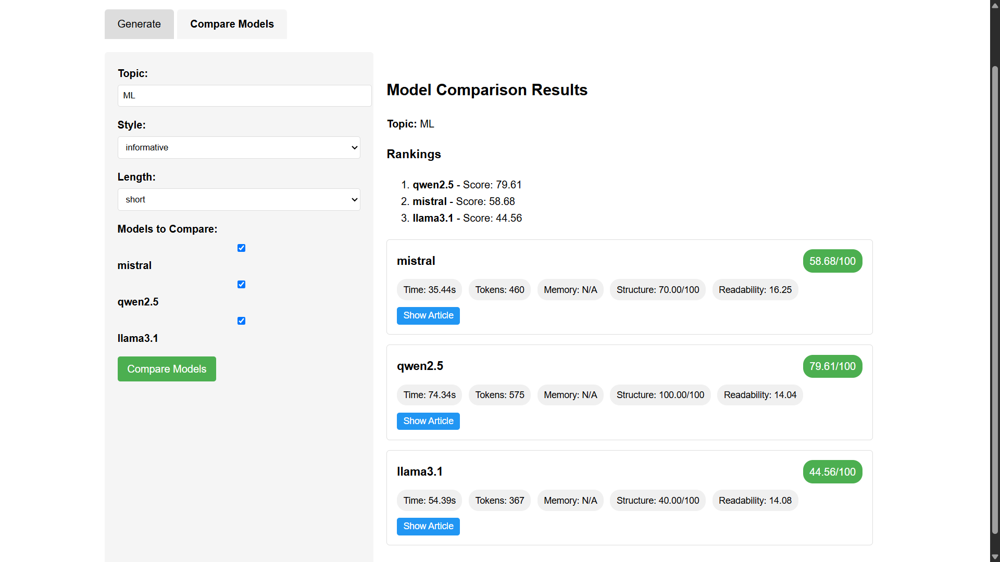
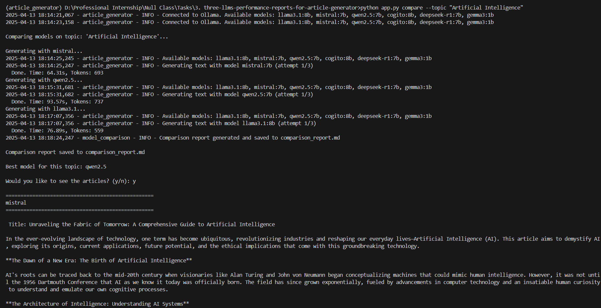

# LLM Article Generator and Comparison Tool

A comprehensive tool for generating articles using different open-source LLMs (Mistral, Qwen2.5, Llama3.1) and comparing their performance to determine which is most appropriate for article creation.



## Features

- Generate articles using three different open-source LLMs
- Compare model performance with detailed metrics
- Interactive chat interface
- Benchmark models on multiple topics
- Web interface for easy article generation
- Qualitative analysis of generated content
- Visualization of model comparisons
- Comprehensive performance reports

## Table of Contents

- [Installation](#installation)
- [Usage](#usage)
  - [Chat Interface](#chat-interface)
  - [Benchmarking](#benchmarking)
  - [Model Comparison](#model-comparison)
  - [Web Interface](#web-interface)
- [Performance Analysis](#performance-analysis)
- [Project Structure](#project-structure)
- [Screenshots](#screenshots)

## Installation

### Prerequisites

- Python 3.8+
- Ollama (for running the LLMs locally)

### Setup

1. **Install Ollama**
   
   Download and install Ollama from [https://ollama.com/download](https://ollama.com/download)

2. **Start the Ollama server**
   ```bash
   ollama serve
   ```

3. **Pull the required models**
   ```bash
   ollama pull mistral:7b
   ollama pull qwen2.5:7b
   ollama pull llama3.1:8b
   ```

4. **Clone this repository**
   ```bash
   git clone https://github.com/AlokTheDataGuy/three-llms-performance-reports-for-article-generator.git
   cd three-llms-performance-reports-for-article-generator
   ```

5. **Install Python dependencies**
   ```bash
   pip install -r requirements.txt
   ```

## Usage

### Chat Interface

The chat interface allows you to interactively generate articles and switch between models.

```
python app.py chat
```

**Commands in chat mode:**
- `help` - Show help message
- `exit` - Exit the chat session
- `switch <model>` - Switch to a different model
- `style <style>` - Set article style (informative, persuasive, narrative, technical, conversational)
- `length <length>` - Set article length (short, medium, long)
- `compare <topic>` - Compare all models on the same topic

### Benchmarking

Benchmark multiple models across different topics to evaluate their performance.

```
python app.py benchmark --models mistral qwen2.5 llama3.1 --topics "Artificial Intelligence" "Climate Change" "Space Exploration" --output benchmark_results.json
```

**Options:**
- `--models` - Models to benchmark (default: all available)
- `--topics` - Topics to use for benchmarks
- `--style` - Article style (default: informative)
- `--length` - Article length (default: medium)
- `--parallel` - Run benchmarks in parallel
- `--output` - Path to save benchmark results

**Example output:**
```
Benchmarking mistral...
  Success rate: 100.0%
  Average time: 61.59 seconds
  Average tokens: 723.0
  Average quality score: 66.6
  Total benchmark time: 63.67 seconds

Benchmark results saved to benchmark_results.json
```

### Model Comparison

Compare different models on the same topic to see which performs best.

```
python app.py compare --topic "Artificial Intelligence"
```



**Options:**
- `--topic` - Topic to use for comparison (required)
- `--models` - Models to compare (default: all available)
- `--style` - Article style (default: informative)
- `--length` - Article length (default: medium)
- `--report` - Path to save comparison report

After running the comparison, you can generate a detailed report:

```
python model_comparison.py --input benchmark_results.json --report comparison_report.md
```


### Web Interface

The web interface provides a user-friendly way to generate articles and compare models.

```
python web_interface.py
```

Then open your browser and navigate to `http://localhost:5000`

**Features:**
- Generate articles with different models
- Compare multiple models on the same topic
- View detailed metrics and analysis
- Interactive UI with expandable article views

## Performance Analysis

The tool evaluates LLM performance based on several metrics:

### Quantitative Metrics
- **Generation Time**: How long it takes to generate an article
- **Token Count**: Number of tokens in the generated article
- **Success Rate**: Percentage of successful generations

### Qualitative Metrics
- **Quality Score**: Overall quality of the article (0-100)
- **Structure Score**: How well-structured the article is (0-100)
- **Readability Grade**: Flesch-Kincaid readability score

### Analysis Factors
- **Has Title**: Whether the article includes a proper title
- **Has Sections**: Whether the article is divided into sections
- **Paragraph Count**: Number of paragraphs
- **Words per Sentence**: Average number of words per sentence

## Project Structure

- `app.py` - Main application with CLI
- `model_comparison.py` - Model comparison utilities
- `text_analysis.py` - Text analysis utilities
- `web_interface.py` - Web interface using Flask
- `templates/` - HTML templates for web interface
- `screenshots/` - Screenshots of the application
- `charts/` - Generated comparison charts


## Command Reference

### Generate an Article (Chat Mode)
```
python app.py chat
```

### Benchmark Models
```
python app.py benchmark --models mistral qwen2.5 llama3.1 --topics "Artificial Intelligence" "Climate Change" --output benchmark_results.json
```

### Compare Models
```
python app.py compare --topic "Quantum Computing" --report comparison_report.md
```

### Generate Comparison Report
```
python model_comparison.py --input benchmark_results.json --report comparison_report.md
```

### Start Web Interface
```
python web_interface.py
```

## Troubleshooting

### Ollama Connection Issues

If you encounter connection issues with Ollama:

1. Check if Ollama is running:
   ```
   ollama ps
   ```

2. Restart Ollama:
   ```
   taskkill /f /im ollama.exe
   ollama serve
   ```

3. Check available models:
   ```
   ollama list
   ```

### Model Not Found

If a model is not found, pull it using:
```
ollama pull mistral:7b
ollama pull qwen2.5:7b
ollama pull llama3.1:8b
```

## 🤝 Contributing

Contributions, issues, and feature requests are welcome! Change different models and compare them. Feel free to check the issues page.

## 📄 License

This project is licensed under the MIT License - see the LICENSE file for details.
